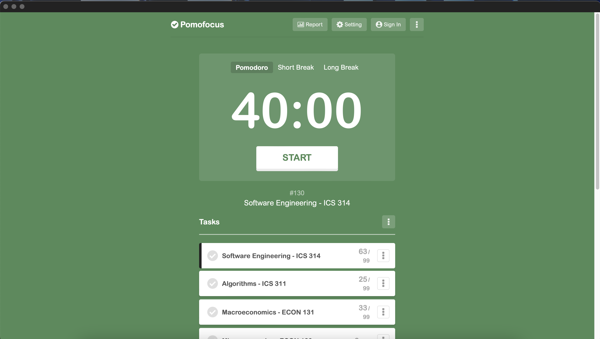

## Introduction

Our group was tasked to create a web application for all the restaurants at UH Manoa. The application features a user-friendly interface for users, vendors, and admins. Users can load up the application to find where they might want to eat, explore the type of food available, and access restaurant contact information. Vendors can submit and upload their restaurant details, including coordinates to display their location on Google Maps. Admins manage and control all aspects of the platform.

## How did you make your effort estimates?

I made most of my effort estimates through a best-guess approach, as I don’t have much experience as a software engineer, particularly in project-based work. With only about three months of exposure to software engineering concepts in ICS 314, I relied on intuition and my limited knowledge to approximate the time required for each task.

For example, I was responsible for a few back-end tasks, including implementing a signup key box specifically for vendors or implementing dynamic map markers to where vendors could automatically display their restaurant on a map. But since I’d never implemented such functionality before, I estimated it might take up to six hours based on my prior experience of working on smaller, less complex coding tasks. While I understood my estimate might be off, it provided a framework to approach the work.

## Benefits from making effort estimates for the issues in advance?

Yes, I believe there are significant benefits to making effort estimates in advance. Two main reasons stand out: Parkinson’s Law, which states, "Work expands to fill the time available for its completion," and the value of gauging your effort and skill level.

Parkinson’s Law illustrates that setting an estimate gives a concrete deadline to work toward, which helps maintain focus and efficiency. Additionally, estimating effort provides a baseline to gauge one’s skill level and identify areas for improvement.

For instance, one seemingly simple task was uploading photos for the test restaurants. I estimated this task would take less than an hour. However, it ended up taking two hours due to unexpected challenges, such as finding images that were non-copyrighted and free to use. Another hurdle was creating logos for the test restaurants using DALL-E. Although the AI-generated logos were mostly fine, one logo consistently had misspelled text, requiring manual editing or regeneration with new prompts.

These experiences taught me that even basic tasks can have unforeseen complexities. Going forward, I can better account for these specfic factors when making estimates.

## Benefits for tracking the actual effort expended on the issues?

Since this project was entirely new to me, tracking actual effort didn’t drastically adjust my workflow. However, it provided valuable insights into how much time specific tasks required. For example, tasks like integrating Google Maps or generating test images revealed that non-coding tasks often took longer than expected. Tracking this time gave me a clearer picture of how to allocate my time in future projects and helped me understand the effort required for different types of work.

## How I tracked my actual effort

I tracked my effort using an application called Pomofocus, which is based on the Pomodoro method. This tool allowed me to set a task, start a timer, and log each completed Pomodoro interval. I adjusted the default work period from 25 minutes to 40 minutes, followed by a 12-minute break, as I found this ratio more effective to me personally.

Pomofocus’s simplicity made it easy to stay consistent and accurate in tracking my time. The enforced breaks also helped me refresh and approach tasks with more energy. Overall, I found this method efficient and reliable.

## Conclusion

This experience reinforced the usefulness of effort estimation and time tracking, even though I had already been using time-tracking methods. Knowing that this was part of a study and assignment gave me a new perspective on how valuable these practices can be, especially in structured projects like this one.

While I plan to continue using Pomofocus, I see potential in exploring tools like WakaTime for future projects. Its integration with VSCode could offer added convenience, though I remain cautious about it's data tracking. Regardless of the method, I will continue leveraging time tracking as a tool for better productivity and efficiency. This project has shown me the importance of both estimating and tracking effort to improve my skills and manage tasks effectively.

