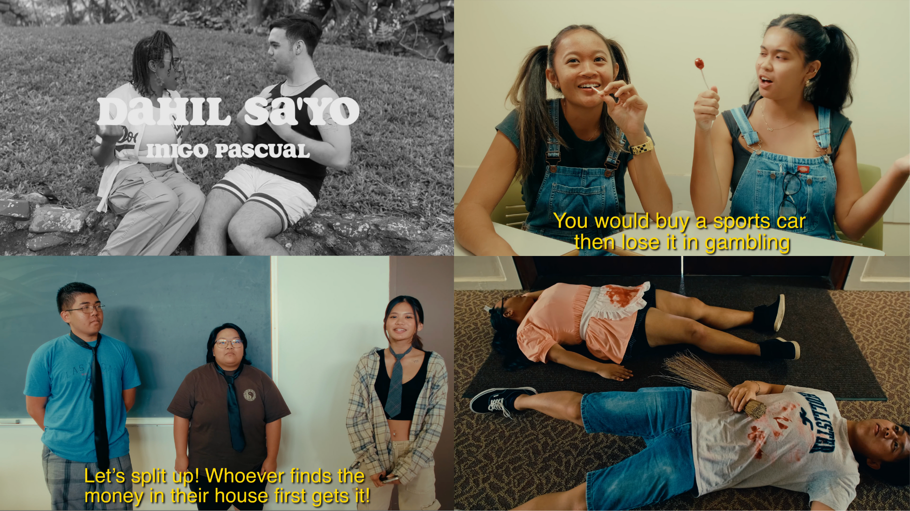
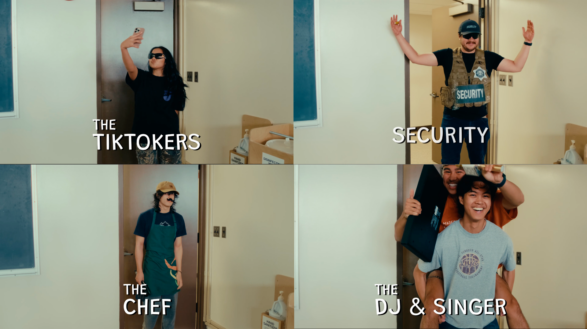

### Introduction
The Katipunan Spring Showcase, an annual event hosted by the Katipunan Club at UH Manoa, celebrates Filipino culture through a film showcase. Students from various Filipino classes create music videos and short films based on the year’s theme. This project not only serves as an artistic expression but also highlights teamwork, creativity, and cultural heritage. In the fall semester, the event is also known as Katipunan Got Talent (KGT).

### My Role and Contributions

In this group project, I played a dual role as an actor in the film and a contributor to the scriptwriting process. As part of the Filipino class, I helped translate English dialogues into Tagalog (Filipino) and created original dialogues that matched the tone and theme of the story. Our film was a blend of comedy, mystery, and soap opera. It opened with a romantic scene, transitioned into musical-style introductions similar to Friends, and concluded with a dramatic twist—a mystery surrounding the death of a character introduced in the opening scene.

Each team member brought unique skills to the table: some focused on filming, editing, or directing, while others managed costumes and props. However, everyone participated as actors, appearing in at least one scene. Collaboration and adaptability were crucial as we balanced our individual responsibilities with the collective vision of the project.

### Lessons Learned
This experience taught me valuable lessons in communication and time management. Coordinating a diverse group with varying schedules required flexibility and creative problem-solving. For instance, we often had to rewrite or adapt scenes to accommodate last-minute changes in actor availability. Additionally, we divided tasks strategically—those living closer to specific stores gathered costume materials, while others with directing ideas took the lead in shaping scenes.
Effective collaboration allowed us to create a smooth, enjoyable filming process, culminating in an award-winning project. Our film was recognized as the best of the semester, a testament to our teamwork and dedication.

